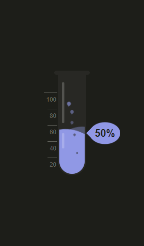

# test-tube.css

Animated test tube work with only CSS and HTML elements, level and color adjustable. [Preview](https://bozworks.github.io/test-tube.css/)

<p align="center">

</p>

<hr>

## CDN

```html
<link
  rel="stylesheet"
  href="https://cdn.jsdelivr.net/gh/bozworks/test-tube.css@master/dist/test-tube.css"
/>
```

## HTML Structure

```html
<div class="tube">
  <div class="shine"></div>
  <div class="body">
    <div class="liquid">
      <div class="percentage"></div>
    </div>
  </div>
  <div class="meter">
    <div>100</div>
    <div>80</div>
    <div>60</div>
    <div>40</div>
    <div>20</div>
  </div>
  <div class="bubbles">
    <div></div>
    <div></div>
    <div></div>
    <div></div>
    <div></div>
  </div>
</div>
```
